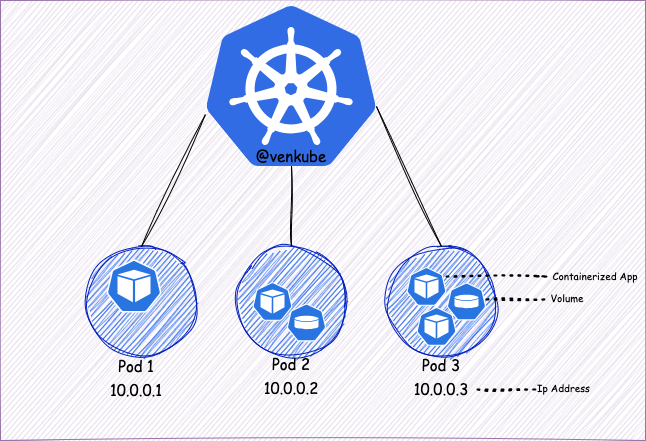

## Pods

<p align='center'>



</p>

`Pods` are the smallest deployable units of computing that you can create and manage in Kubernetes.

+ A `Pod` is a group of one or more container with shared storage and network resources, and a specification for how to run the containers.

+ A `Pod` is an app machine (not a server) to exposes resources to applications, while a server is used to create and manage Kubernetes cluster.

To define a Pod which consists of a container.

```yaml
apiVersion: v1
kind: Deployment
metadata:
    name: ocr
    labels:
        app: ocr
spec:
    containers:
        - name: ocr-service
          image:  registry.gitlab.com/...
          imagePullPolicy: Always
          ports:
            - containerPort: 8080
          volumeMounts:
            - mountPath: /root/ocr
              name: license
            - mountPath: /api/logs
              name: logs
          resources:
            requests:
                memory: "2000Mi"
          env:
            - name: ENV
              value: "production"
          lifecycle:
            preStop:
                exec:
                    command: ["/bin/bash", "-c", "sleep 15"]
```

### Workload resources for manage pods

Usually, don't need to create Pods directly, even singleton Pods. Instead, create them using workload resources such as Deployment or Job.


#### 1. Deployments

> A Deployment manages a set of Pods to run an application workload, usually one that doesn't maintain state. A `Deployment` provides declarative updates for `Pods` and `ReplicaSets`

#### 2. ReplicaSet

> A ReplicaSets's purpose is to maintain a stable set of replica Pods running at any given time. As such, it is often used to guarantee the availability of a specified number of idential Pods.